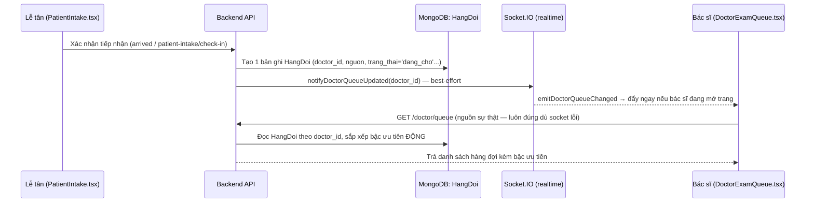

# Tóm tắt chức năng: Tiếp nhận tại quầy (Lễ tân) và kết nối với Bác sĩ

> Tài liệu này giải thích chức năng "Tiếp nhận tại quầy" của Lễ tân, và **quan trọng nhất**: nó
> kết nối với phía Bác sĩ bằng cơ chế gì, qua bảng dữ liệu nào — để người đọc không cần mở code
> vẫn hình dung được luồng dữ liệu đi đâu.

## 1. Chức năng này dùng để làm gì

Trang **"Tiếp nhận tại quầy"** (`PatientIntake.tsx`, route phía lễ tân) là nơi lễ tân ghi nhận một
bệnh nhân **đang đứng trước mặt** — dù họ đã đặt lịch online từ trước hay đến trực tiếp không đặt
trước — để bệnh nhân đó bắt đầu được xếp vào hàng chờ khám.

Giao diện chia làm 3 bước rõ ràng:

| Bước | Nội dung | Áp dụng khi |
|---|---|---|
| **1. Nhận diện người bệnh** | Tra cứu theo SĐT/họ tên, xác nhận đúng hồ sơ (chặn nhầm người) | Luôn làm đầu tiên |
| **2A. Lịch hẹn đã đặt** | Xác nhận lịch hẹn online hôm nay, đối chiếu đúng hồ sơ vừa tra | Khách đã đặt lịch trước |
| **2B. Chưa có lịch hẹn** | Tạo hồ sơ tại chỗ (nếu khách mới), chọn slot còn trống theo mức độ hiển thị | Khách vãng lai, không đặt trước |
| **3. Đánh giá khả năng tiếp nhận** | Bảng mức độ còn chỗ (còn nhiều/còn ít/đã đầy — **không** lộ số chính xác, đúng chính sách "lễ tân không nhận đặt hộ qua điện thoại") | Trước khi xác nhận tiếp nhận |

Sau khi xác nhận, hệ thống in ra **phiếu số thứ tự thật** cho khách cầm, có nút in lại nếu cần.

## 2. Hai đường tiếp nhận — nhưng CÙNG một đích đến

Về mặt kỹ thuật có hai API khác nhau tuỳ tình huống, nhưng cả hai đều tạo ra **cùng một loại bản
ghi**: một dòng trong bảng `HangDoi` (hàng đợi khám).

```
Khách ĐÃ có lịch hẹn online
  → PATCH /receptionist/appointments/:id/arrived
  → service checkInLichHen()  (backend/src/services/checkIn.service.js)
  → tạo 1 bản ghi HangDoi (nguon='online') + đổi LichHen.status='checked_in'

Khách CHƯA có lịch hẹn (vãng lai, đã có hồ sơ)
  → POST /receptionist/patient-intake/check-in
  → service tiepNhanHoSoVaoHangDoi()  (backend/src/services/offlineIntake.service.js)
  → tự chọn 1 slot loại 'walk_in' còn trống (đúng khung đang diễn ra/kế tiếp, đúng quota
    70/30 online-walkin của rule lịch làm việc bác sĩ)
  → tạo 1 bản ghi HangDoi (nguon='offline')
```

**Vì sao gộp chung 1 đích đến quan trọng:** đây chính là quy tắc "bất biến" của hệ thống — *lễ tân
và bác sĩ dùng CHUNG một dịch vụ check-in, một bảng hàng đợi* — không phải hai luồng riêng biệt dễ
lệch nhau. Trước khi quy tắc này được áp dụng, hệ thống từng có lỗi: khách đã trả tiền, đã tới
quầy, lễ tân bấm "đã đến" nhưng KHÔNG có bản ghi hàng đợi → bác sĩ không bao giờ thấy khách này
trong hàng chờ, và cuối ca khách còn bị hệ thống tự đánh dấu "không đến" (mất 100% tiền theo chính
sách không hoàn tiền). Gộp chung một đích đến (`HangDoi`) triệt tiêu hẳn lớp lỗi này.

## 3. Cơ chế kết nối với Bác sĩ — trả lời trực tiếp câu hỏi "kết nối qua gì"

**Kết nối qua bảng `HangDoi` (collection MongoDB dùng chung), cộng với đẩy realtime qua WebSocket.**
Không có API "gửi thông báo cho bác sĩ" riêng — bác sĩ tự đọc thẳng từ hàng đợi.



**3 điểm quan trọng cần nhớ:**

1. **`HangDoi.doctor_id` là khoá nối** — mỗi bản ghi hàng đợi gắn chết với 1 bác sĩ cụ thể (được
   gán khi lễ tân xác nhận, hoặc tự động gán nếu là luồng tự gán bác sĩ). Bác sĩ chỉ nhìn thấy
   đúng hàng đợi của mình (`doctor_id` khớp), không thấy của bác sĩ khác.
2. **Realtime là "tiện", không phải "cần"** — comment trong code ghi rõ: *"Realtime is a
   best-effort notification. The database write remains the source of truth."* Nếu socket rớt,
   trang bác sĩ vẫn lấy đúng dữ liệu ở lần gọi `GET /doctor/queue` kế tiếp — không có khách nào
   biến mất chỉ vì lỗi mạng.
3. **Bậc ưu tiên không lưu cứng lúc tiếp nhận** — được tính lại **mỗi lần bác sĩ tải trang** dựa
   trên giờ hẹn gốc + thời điểm check-in hiện tại, để người đến sớm không bị thiệt, người tới đúng
   khung được ưu tiên đúng lúc.

### Mắt xích chiều ngược lại: bác sĩ biết ai "còn chưa tới"

Ngoài hàng đợi (ai đã tới), còn có 1 API riêng cho biết **ai đã đặt lịch hôm nay nhưng CHƯA được
tiếp nhận**: `GET /doctor/queue/pending-checkin` (hàm `layLichChoTiepNhan` cùng file
`checkIn.service.js`). Đây là danh sách để bác sĩ/lễ tân biết còn ai đang trên đường tới nhưng
chưa vào hàng đợi — tách biệt với hàng đợi thật (`HangDoi`), vì lịch chưa tiếp nhận thì chưa có
quyền chiếm chỗ trong hàng chờ khám.

## 4. Các kết nối khác (không phải bác sĩ, nhưng cùng xuất phát từ 1 lần tiếp nhận)

Mỗi lần tiếp nhận thành công còn kéo theo 3 việc khác, **cùng nằm trong 1 lần gọi service**, không
phải bước riêng lễ tân phải làm thêm:

| Kết nối tới | Cơ chế | Mục đích |
|---|---|---|
| **Nhật ký thao tác** (`NhatKyThaoTac`) | `ghiNhatKyLeTan()` ghi hành động `LT_CHECK_IN` | Admin xem lại ai tiếp nhận ai, lúc nào — trang "Nhật ký ca trực" |
| **Quét không-đến cuối ca** (`noShowSweep.service.js`) | Chỉ đánh dấu `no_show` khi **KHÔNG có** bản ghi `HangDoi` | Khách đã tiếp nhận (có `HangDoi`) thì **không bao giờ** bị tính không-đến, dù trễ bao lâu |
| **Thanh toán/hóa đơn** (`billing.controller.js`) | Đọc lại đúng `HangDoi._id` sau khi bác sĩ khám xong | Lễ tân lập hóa đơn dựa trên cùng bản ghi hàng đợi đã tạo lúc tiếp nhận |

## 5. Ghi chú kỹ thuật (dành cho người sẽ đụng vào code sau này)

- File `checkIn.service.js` còn giữ 1 hàm cũ `checkInVangLai()` — **không còn được gọi ở đâu nữa**
  trong code hiện tại (đã bị thay bằng `tiepNhanHoSoVaoHangDoi()` có kiểm tra quota/slot chặt chẽ
  hơn). Không phải lỗi, chỉ là code cũ chưa dọn — nếu sau này cần sửa luồng tiếp nhận vãng lai, sửa
  đúng ở `offlineIntake.service.js`, không sửa nhầm hàm cũ.
- Route lễ tân bắt buộc `verifyToken` + `requireRole('receptionist','admin')` — không gọi được nếu
  thiếu token hợp lệ.
